# What's the Weather Like?

## Background

Whether financial, political, or social -- data's true power lies in its ability to answer questions definitively. So let's answer a fundamental question: "What's the weather like as we approach the equator?"

Now, we know what you may be thinking: _"Duh. It gets hotter..."_

But, if pressed, how would you **prove** it?

## Technologies Used
- Python
- OpenWeatherMap API
- JSON traversals
- Google Places API

## Objectives

### WeatherPy

Create a Python script to visualize the weather of 500+ cities across the world of varying distance from the equator.
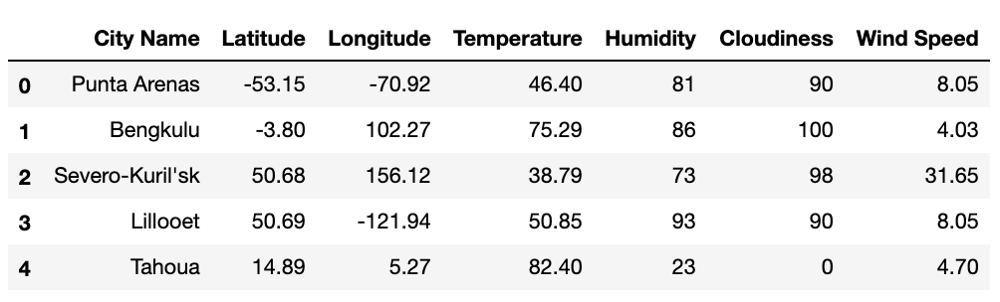

Create a series of scatter plots to showcase the following relationships:

* Temperature (F) vs. Latitude
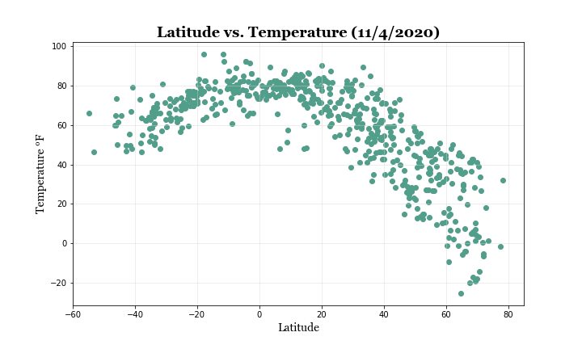
* Humidity (%) vs. Latitude
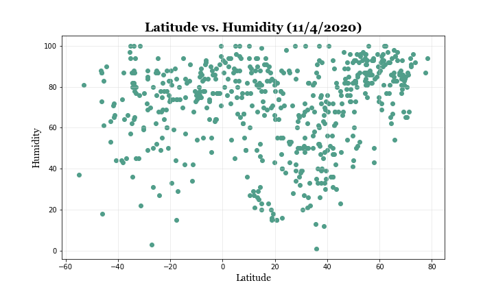
* Cloudiness (%) vs. Latitude
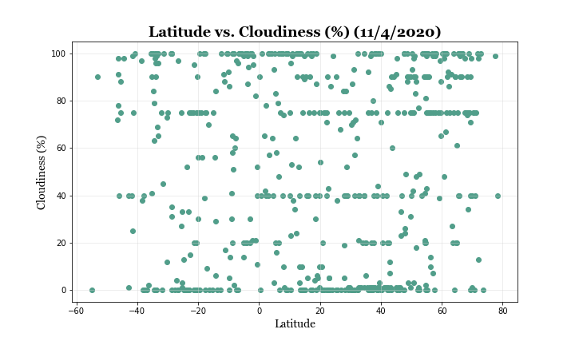
* Wind Speed (mph) vs. Latitude
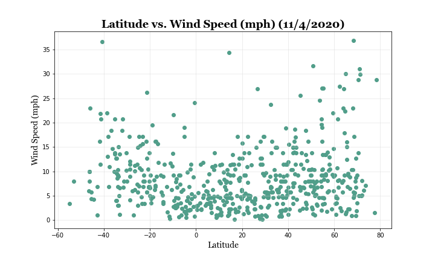

Run linear regression on each relationship. This time, separate the plots into Northern Hemisphere (greater than or equal to 0 degrees latitude) and Southern Hemisphere (less than 0 degrees latitude):

* Northern Hemisphere - Temperature (F) vs. Latitude
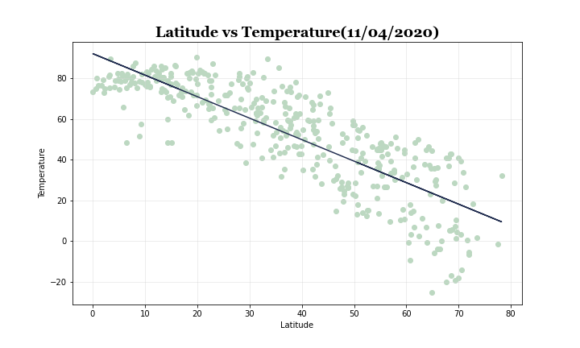
* Southern Hemisphere - Temperature (F) vs. Latitude
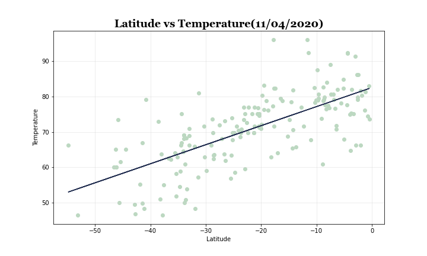
* Northern Hemisphere - Humidity (%) vs. Latitude

* Southern Hemisphere - Humidity (%) vs. Latitude

* Northern Hemisphere - Cloudiness (%) vs. Latitude
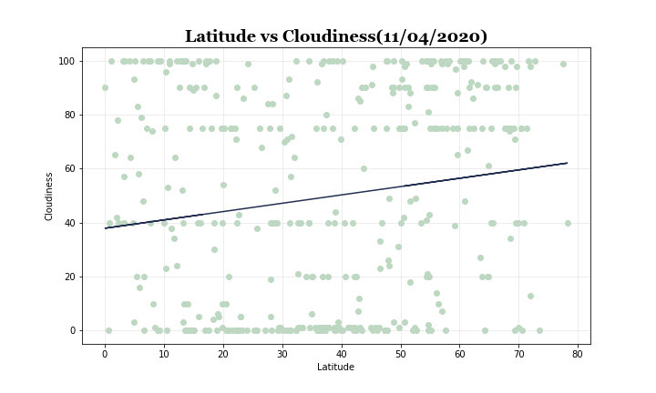
* Southern Hemisphere - Cloudiness (%) vs. Latitude
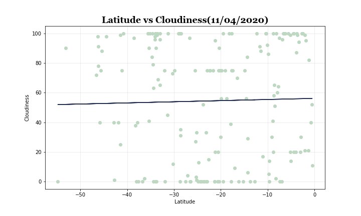
* Northern Hemisphere - Wind Speed (mph) vs. Latitude
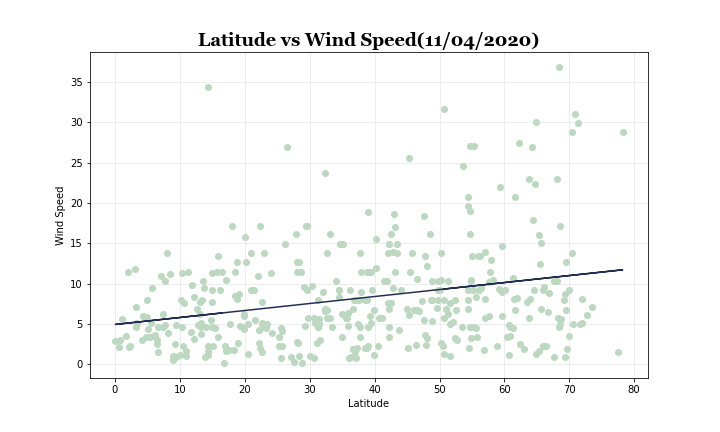
* Southern Hemisphere - Wind Speed (mph) vs. Latitude
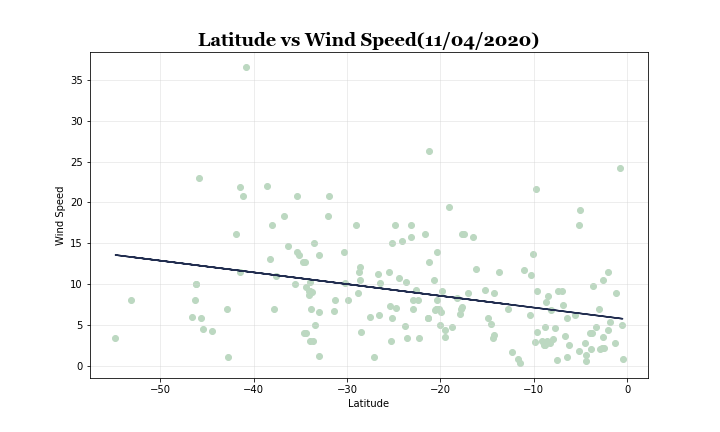

#### Observations
- Observation 1: Of the four factors analyzed, the strongest correlation was between northern hemisphere temperature and latitude.
- Observation 2: The highest temperatures are found near the equator and decrease as you move towards the polar regions.
- Observation 3: Cloudiness does not have a strong correlation to latitude.

### VacationPy

* Create a heat map that displays the humidity for every city from Part I.

  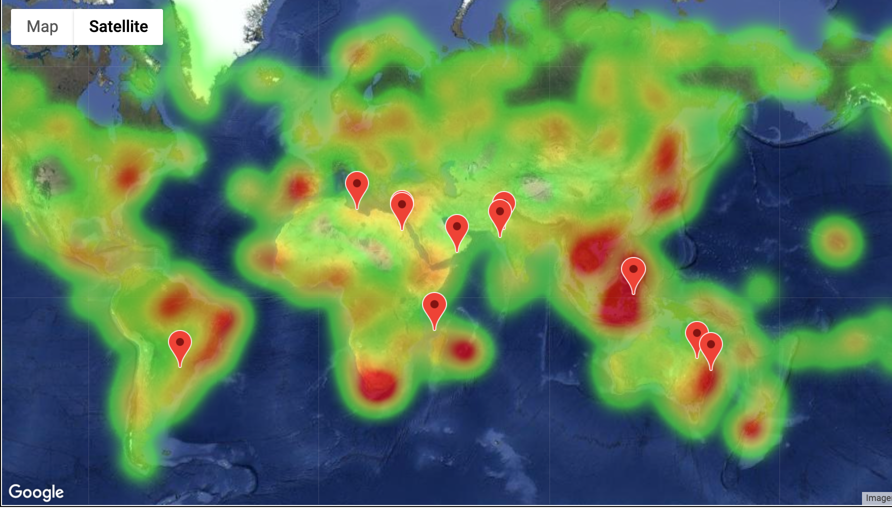

### Copyright

Alex Arnold © 2020. All Rights Reserved.
